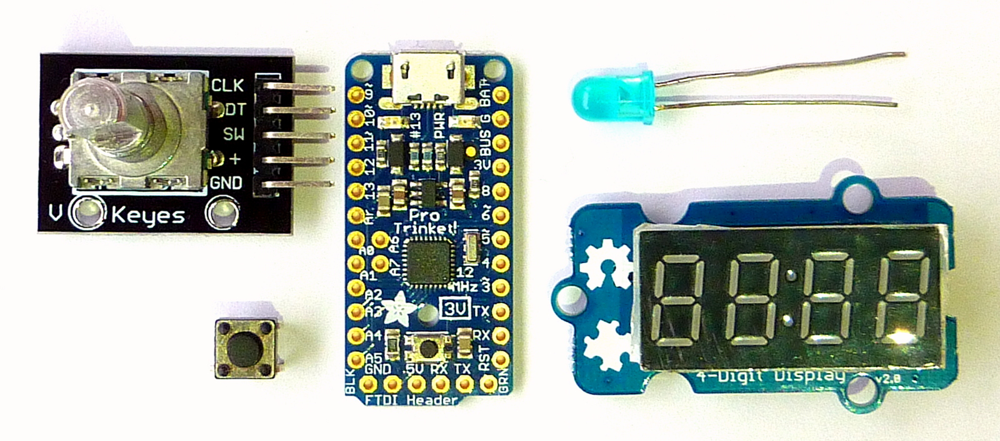

# Moon phase calendar
For [Arduino](https://www.arduino.cc/), using an [Adafruit Pro Trinket](https://www.adafruit.com/products/2010) board.

**Contents**
- [Moon phase calendar hardware](#moon-phase-calendar-hardware)  
- [Moon phase calendar algorithms](#moon-phase-calendar-algorithms)  
- [Developing and testing the software](#developing-and-testing-the-software)  
- [Notes and references](#notes-and-references)  
- [Appendix A: test specification](#appendix-a-test-specification)  

The moon phase calendar shows a date and the [moon phase](http://www.timeanddate.com/astronomy/moon/about-moon-phases.html) for that date. The date starts at a pre-programmed start date. A rotary encoder lets you adjust the date forward and backward. As an alternative to the rotary encoder you can use a push button to advance the date.

The date is shown on a 4-digit 8-segment display as the year `yyyy`, quickly followed by the day and month as `ddmm`. The moon phase is presented as one of eight phases via four series of LEDs.

In the initial stages of creating the planned functionality, we'll omit the manual inputs and automatically advance the date once a second.

Moon phase calendar hardware
------------------------------


We use the following components:
- [Adafruit Pro Trinket - 3V 12MHz](https://www.adafruit.com/products/2010) (*)
- [Rotary encoder](), input initially unused
- [Push button](), alternate input initially unused
- [Grove - 4-Digit Display](http://www.seeedstudio.com/wiki/Grove_-_4-Digit_Display)
- 16 LEDs (2 groups of three, 2 groups of five LEDs)

(*) You can also use the 5V version.

The diagram below gives a schematic overview of the circuitry.
```
                              ^
 Adjust Date                  |
next/previous         +-------+-------+         Moon phase
     o  o             |               |            o  o
  o        o          |               |         o  o  o  o
 o          o ---/--->|               |---/-----o  o  o  o
 o          o    2    |               |   4     o  o  o  o
  o        o          |  Pro Trinket  |            o  o
     o  o             |               |       4-segment LEDs
Rotary encoder        |               |
                      |               |           Date
                      |               |        ddmm [yyyy]
      next            |               |        +---------+
      +||--------/--->|               |---/----| 3 1 1 2 |
                 1    |               |   2    +---------+
   Push button        |               |       4-digit display
                      |               |
                      +-------+-------+
                              |
                             ---
```

Moon phase calendar algorithms
--------------------------------
To perform its function the program must be able to:

1. Determine a date before or after another date.
1. Determine the moon phase of a specific date.

### Compute new date
To compute a new date from an existing one we need a function to advance a date, say 28 February 2016 to 29 February 2016 (note the leap year) and from 29 February to 1 March 2016. The standard C library contains funtion [mktime]() that allows to *just add a day* to a date and compute a valid date from a probably invalid date. So given 30 February 2016 `mktime()` will adjust the date to 1 March 2016.

As the standard C library function `mktime()` isn't readily available in the Arduino environment, we created the needed functionality inspired on function [mktime()](https://www.sourceware.org/git/gitweb.cgi?p=newlib-cygwin.git;a=blob_plain;f=newlib/libc/time/mktime.c;hb=HEAD) from the [newlib library](https://en.wikipedia.org/wiki/Newlib) maintained by [Red Hat](). Our function only handles dates (not time).

### Compute moon phase
For the moon phase we need a function that can compute the phase from date. ...

Developing and testing the software
------------------------------------
The moon phase calendar software is developed using both the Arduino IDE and a separate [C++11](https://en.wikipedia.org/wiki/C%2B%2B11) compiler on a personal computer. The software is developed and tested as a PC program using the [*lest* test framework](https://github.com/martinmoene/lest). The Arduino IDE is used to verify that what we develop as a C++ program is acceptable as an Arduino program. The IDE is also used to upload the program to the Pro Trinket.

### Prerequisites
In what follows, it is expected that the [Arduino IDE](https://www.arduino.cc/en/Main/Software) is available. If you want to compile and run the tests, a C++11 compiler such as [GNU C++](https://gcc.gnu.org/) or [Visual C++ 2015](https://www.visualstudio.com/) is needed, see [11-13]. 
 
### Setup Arduino IDE for Pro Trinket
To be able to compile programs for the Pro Trinket board and to upload the result to it via [USB](https://en.wikipedia.org/wiki/USB), several settings must made in the Arduino IDE. This is described in [Setup Arduino IDE for Pro Trinket](doc/Setup Arduino IDE for Pro Trinket.md).

### Install Arduino library for TM1637 (LED Driver)
The program uses the [Grove 4-Digit Display](http://www.seeedstudio.com/wiki/Grove_-_4-Digit_Display) with a [TM1637 chip](http://blog.avishorp.me/2014/03/arduino-library-for-tm1637-display.html) to present the date. To enable using it from our program, install the [Arduino library for TM1637](https://github.com/avishorp/TM1637) as follows:

- Download the [library's latest .zip file](https://github.com/avishorp/TM1637/releases/latest) in a convenient (temporary) location.
- Start the Arduino IDE.
- Select *Sketch > Include Library > .ZIP Library...* and 
- Select the downloaded file `TM1637-1.0.0.zip`.

This installs the library in the `Arduino\libraries\TM1637-1.0.0` subdirectory in your home directory. The library appears under *Contributed libraries* at the bottom of the *Sketch > Include Library* list. You may now remove the downloaded .zip file.

### Developing and testing the software

Initially we develop the program without the hardware being available. To gain confidence that what we develop makes sense and works, we develop the program guided by a specification that we implement as test cases that we run as a PC program. This approach is called [test-driven development (TDD)](https://en.wikipedia.org/wiki/Test-driven_development), or test-driven design, depending what you'd like to emphasise. 

Here is how we go about it. 

In our [test program](test/test.cpp) we:

- include the file [arduino.hpp](test/arduino.hpp) in which we emulate elements from the Arduino environment that we need, such as `pinMode()` and `digitalWrite()`, in a form that we can use with our tests;
- include the file to contain our [Arduino program](arduino/MoonPhaseCalendar/MoonPhaseCalendar.ino) to get access to the application code;
- include the single-header [*lest* test framework](test/lest.hpp) and other include files we need.

This approach works well if our Arduino program is relatively small and is present in a single file.

Then we write the specification (tests) and the application code in a mix of [test-first](https://en.wikipedia.org/wiki/Test-driven_development) and test-after style. Driving the development of the application code from the specification automatically leads to code that *can* be tested and prevents us from writing code for which there's no need [14]. To enable end-to-end testing, we extract the functionality that appears in `loop()` to the single function `once( Date date, ...)` so that it can be run once in a test (see the [acceptance tests](https://github.com/MarkMoene/MoonPhaseCalendar/blob/master/test/test.cpp#L208)).

The test program can be compiled and run from a console or [cmd prompt](https://en.wikipedia.org/wiki/Cmd.exe) using the scripts [mk-gcc](test/mk-gcc.bat) and [mk-msvc](test/mk-msvc.bat), depending on the compiler you'd like to use. If all is well, the tests produce no output. If you want to see the passing tests run, use `test --pass`.

To see the tests that are available, issue `test --list-tests`. If you use `test --list-tests @` you'll see several more tests that are not run unless you specifically mention them on the command line. These extra test are not run at default due to the *tag* that starts with `[.` in their name.

There's one [test tagged *[.app]*](https://github.com/MarkMoene/MoonPhaseCalendar/blob/master/test/test.cpp#L252) that acts as a small application. It shows a date with corresponding moonphase on the console, continually advancing the date, e.g. `(2016, 2,29) (|...`. 

Finally, even without the peripherals connected to the Pro Trinket board we can perform a useful test with the Arduino code *running on the board*. We locate the left-most segment of the 4-segment moon phase indicator on the onboard LED and compile and upload the program that advances the date once a second to the Pro Trinket. Then we notice the onboard LED going on for about 14&nbsp;s and off for 14&nbsp;s. This corresponds to the moon-month of 29 days: 1 s/day * 29  days/full moon means repetition of the cycle each 29 s, or 14.5 s between LED going on and off.

Notes and references
----------------------

### Arduino
[1] Arduino. [Home](https://www.arduino.cc/).  
[2] Arduino. [Language Reference](https://www.arduino.cc/en/Reference/HomePage).  
[3] Arduino. [Interfacing with Hardware](http://playground.arduino.cc/Main/InterfacingWithHardware).  

### Hardware
[4] Adafruit. [Pro Trinket](https://www.adafruit.com/products/2010).  
[5] Adafruit. [Introducing Pro Trinket](https://learn.adafruit.com/introducing-pro-trinket/).  
[6] Atmel. [Datasheet of ATmega328 Microcontroller (PDF)](http://adafruit.com/datasheets/ATMEGA328P.pdf).  
[7] Arduino. [TM1637 is a chip for driving 7-segment displays](http://playground.arduino.cc/Main/TM1637).  
[8] Grove. [4-Digit Display](http://www.seeedstudio.com/wiki/Grove_-_4-Digit_Display).  

### Moon phase
[9] John Walker. [Moontool for Windows](http://www.fourmilab.ch/moontoolw/). 16 March 1999.  
[10] Voidware. [Moon phase](http://www.voidware.com/moon_phase.htm), using integral numbers.

### C++11 Compilers
[11] [Microsoft Visual C++ 2015](https://www.visualstudio.com/).  
[12] [GNU Compiler Collection binary distributions](https://gcc.gnu.org/install/binaries.html).  
[13] [Stephan T. Lavavej's MinGW distribution](http://nuwen.net/mingw.html).

### Design and test
[14] Wikipedia. [Test-Driven Development (TDD)](https://en.wikipedia.org/wiki/Test-driven_development), [section benefits](https://en.wikipedia.org/wiki/Test-driven_development#Benefits).    
[15] Martin Moene. [*lest* test framework](https://github.com/martinmoene/lest).

Appendix A: test specification
-------------------------------
Issuing command `test\test.exe -l @` gives the following listing of the test specification:
```
Convenience: bit sets proper bit
Convenience: bit tests true for set bits
Convenience: bit tests false for unset bits
Convenience: setbit manipulates proper bit
Electronics: Rotary encoder: ... [.rotary]
Electronics: Button: ... [.button]
Electronics: Date display reports 31 Dec as 3112 [date]
Electronics: Date display reports 1 Jan as 0101 [date]
Electronics: Moon phase display sets pins properly [moon]
Algorithm: A leap year if divisible by 400 [leap]
Algorithm: A leap year if divisible by 4 but not by 100 [leap]
Algorithm: Not a leap year if not divisible by 4 [leap]
Algorithm: Not a leap year if divisible by 100 but not by 400 [leap]
Algorithm: 1 Jan 2000 is adjacent to 2 Jan 2000 [date]
Algorithm: 28 Feb 2000 is adjacent to 29 Feb 2000 (leap year) [date]
Algorithm: 28 Feb 2015 is adjacent to 1 Mar 2015 (non leap year) [date]
Algorithm: 31 Dec 2015 is adjacent to 1 Jan 2016 [date]
Algorithm: New moon on 13 Oct 2015 [moon]
Algorithm: First quarter on 20 Oct 2015 [moon]
Algorithm: Full moon on 27 Oct 2015 [moon]
Algorithm: Last quarter on 3 Nov 2015 [moon]
Acceptance: New moon on 13 Oct 2015 [.accept]
Acceptance: First quarter on 20 Oct 2015 [.accept]
Acceptance: Full moon on 27 Oct 2015 [.accept]
Acceptance: Last quarter on 3 Nov 2015 [.accept]
App: date-moon phase [.app]
```
