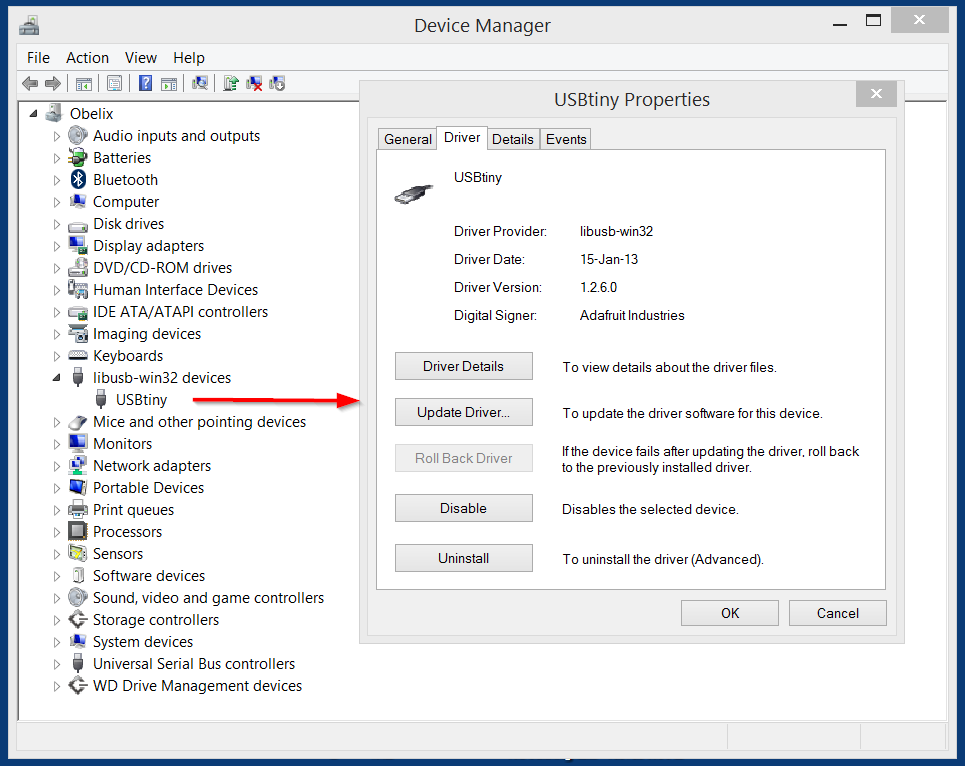
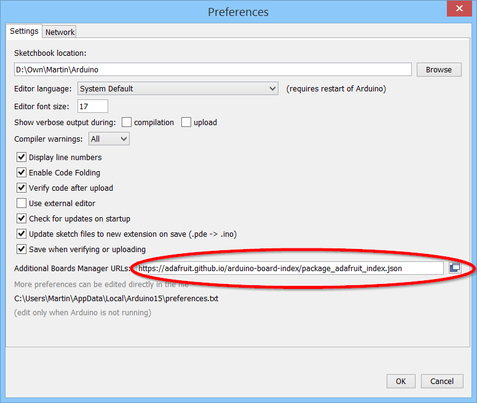
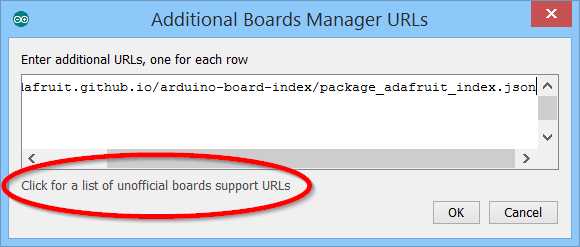

Setup Arduino IDE for Pro Trinket
===================================
 **Install Driver for Pro Trinket, see [Using the USB bootloader](https://learn.adafruit.com/introducing-pro-trinket/starting-the-bootloader):**

- Download the [Pro Trinket Drivers](http://www.adafruit.com/downloads/usbtiny_signed_8.zip) for Windows and unzip.
- Connect Pro Trinket to USB port, specify location (toplevel directory) of driver.
- (If needed, manually Update Driver in Windows Device Manager.)
  

 **In Arduimo 1.6.6 open File > Preferences:**

- Add Board Manager URL for Adafruit boards (see [list](https://github.com/arduino/Arduino/wiki/Unofficial-list-of-3rd-party-boards-support-urls)):  
  https://adafruit.github.io/arduino-board-index/package_adafruit_index.json

 **[List of additional Boards Manager URLs](https://github.com/arduino/Arduino/wiki/Unofficial-list-of-3rd-party-boards-support-urls) (click folder icon in above panel):**

 **Select board and programmer:**

Open board manager, Tools > Board, Board Manager

- Select **Contributed**.
- Click **Adafruit AVR Boards** (Installing...).
- *Quit and restart Arduino IDE*.
- Select Tools > Board > **Pro Trinket 3V/12MHz (USB)**
- Select Tools > Programmer > **USBtinyISP**

 **Test if program can be uploaded to Pro Trinket:**

- Load blink example, File > Examples > 01.Basics > **Blink**
- Compile code: Sketch > **Verify/Compile** (Ctrl+R)
- **Activate bootloader** on Trinket: press button on Pro Trinket:
- Red LED **glows** brighter/less bright
- Upload program: Sketch > **Upload** (Ctrl+U)::
- Red LED **blinks** 1s on, 1s off

